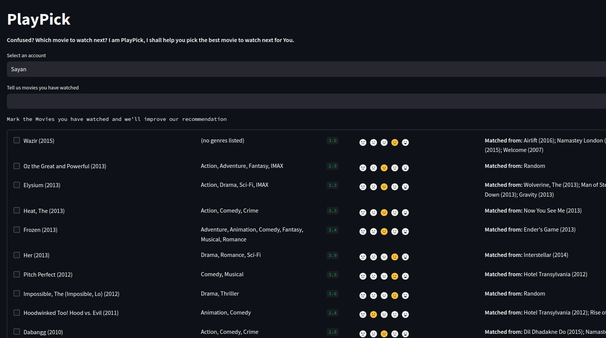
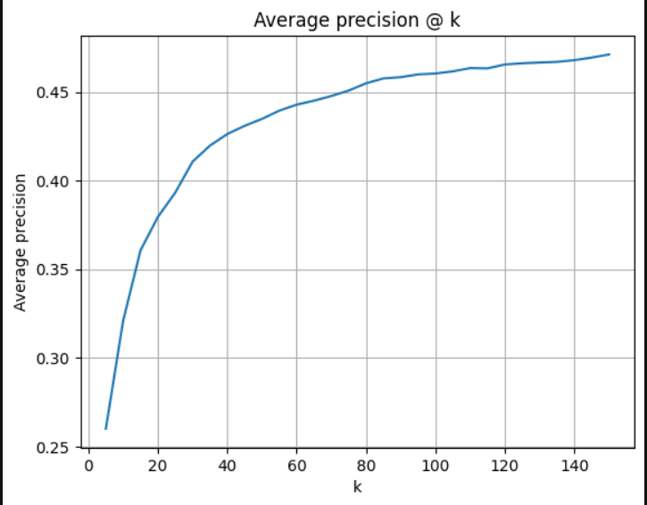

# Playpick: Discover Movie Gems with Collaborative Recommendations

Harness the wisdom of the crowd to find movies you'll love! Playpick is a persistent, multi-user web app that delivers personalized movie recommendations using collaborative filtering techniques.

## Key Features

- **Persistent recommendations:** Your preferences are saved for consistently tailored suggestions.
- **Collaborative filtering:** Uncover hidden gems based on the ratings of like-minded users.
- **Streamlit frontend:** Enjoy a user-friendly and interactive experience.
- **MongoDB integration:** Seamless data storage and retrieval.
- **Model optimization:** Quantized model for efficient deployment within Streamlit Cloud's 1GB limit.
- **Performance tracking:** Average Precision@20 of 0.3795 and Average Precision@100 of 0.4604.

## Get Started

- **Explore the app live:** https://pick-1-movie.streamlit.app

## Technical Highlights

- **Data Collection:** Aggregates latest IMDb movie dataset.
- **Data Cleaning:** Removes obsolete movies and insignificant users for enhanced model accuracy.
- **Correlation Matrix:** Uncovers patterns in user ratings using a pivot table.
- **Model Quantization:** Reduces model size by half for efficient deployment.
- **Performance Evaluation:** Average Precision@k metrics ensure recommendation quality.

## Screenshots

**PlayPick Interface:**

**Evaluation Metrics:**

Metrics: Avg Precision@20=0.3795 Avg Precision@100=0.4604

